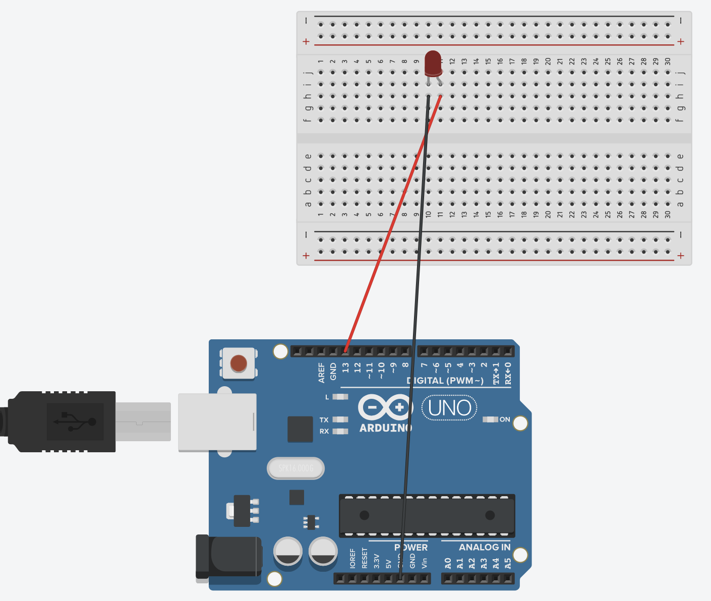

# Práctica 1 - Encender y apagar un led
## Componentes necesarios
- Un led (luz de color rojo)
- Una protoboard (investiga cómo funcionan las placas protoboads)
- Una placa Arduino (por ejemplo la R3) 
## Esquema

## Código
```
int led = 13;
void setup() {
pinMode(led, OUTPUT);
}
void loop() {
digitalWrite(led, HIGH);
delay(1000);
digitalWrite(led, LOW);
delay(1000);
}
```

### Nota
La salida 13 ha de ir al ánodo del led, y el cátodo a Ground. Esto es importante ya que el led tiene polaridad.


